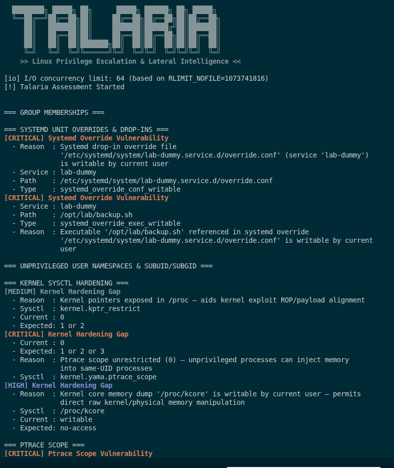
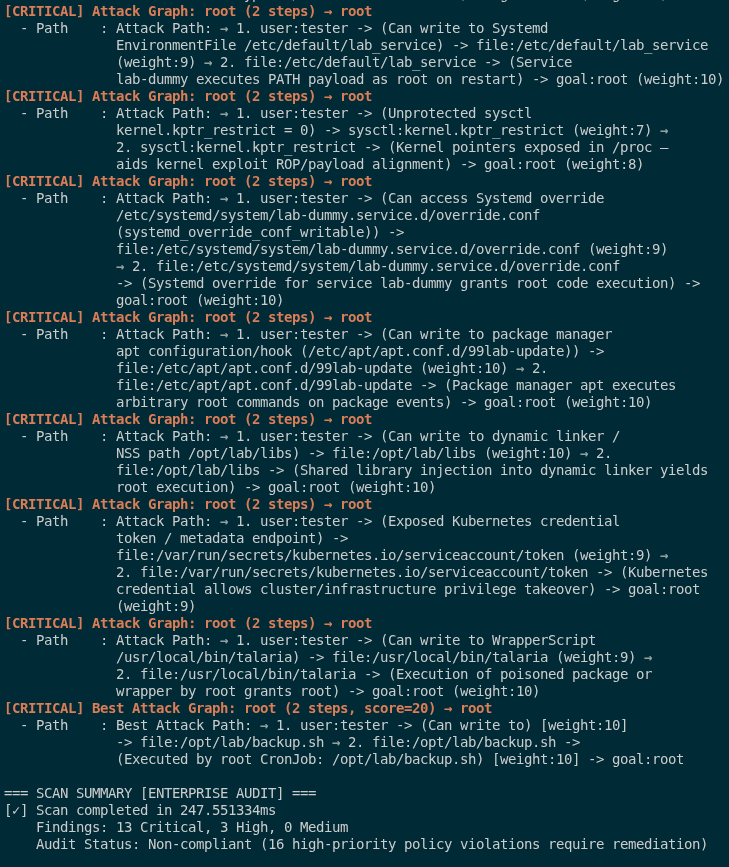

<p align="center">
  
</p>

# Talaria — Fast, Zero-Dependency Linux Privilege Escalation Engine

<p align="center">
  <a href="https://golang.org/"></a>
  <a href="LICENSE"></a>
  
  
  
  <a href=".github/workflows/ci.yml"></a>
  <a href=".github/workflows/security.yml"></a>
</p>

---

## ⚡ What is Talaria? (In 30 Seconds)

**Talaria** is a high-speed, single-binary Linux privilege escalation scanner and attack-chain engine written in 100% pure Go. 

When you land on an unprivileged Linux shell during an assessment or security audit, you need to know how an attacker could elevate privileges to `root`. Traditional scripts can be noisy, slow, and leave traces on disk. 

Talaria solves this:
- **Instant Execution:** Audits the entire operating system in **milliseconds (<15ms–800ms)**.
- **Single Static Binary:** Zero third-party dependencies. Runs standalone on any Linux system without needing Python, Perl, Bash, or GCC.
- **Pure Read-Only Safety:** Opens all system files with `O_RDONLY`. Never writes temporary files to `/tmp` or touches disk state.
- **Attack Graph Intelligence:** Instead of dumping an overwhelming wall of text, Talaria links individual misconfigurations into **confirmed multi-stage attack chains** solving for root privilege (`goal:root`).
- **Enterprise-Ready:** Exports clean terminal dashboards, structured JSON for SIEMs, and SARIF for GitHub Code Scanning.

---

## 🔍 Why Talaria vs. Traditional Tools?

| Feature | Talaria | Traditional Bash Scripts (e.g. LinPEAS) |
| :--- | :--- | :--- |
| **Runtime Requirements** | **Zero.** Single self-contained static binary | Requires `/bin/bash`, Python, or system utilities |
| **Execution Latency** | **Sub-second (<15ms–800ms)** | 2 to 10+ minutes of high CPU/disk activity |
| **Disk & State Footprint** | **Zero disk writes.** 100% in-memory analysis | Frequently writes temporary files to `/tmp` |
| **Privilege Chaining** | **Autonomous DAG solver** (`goal:root` trajectories) | Manual user correlation through long text output |
| **Operational Modes** | Dual-mode: Offensive CTF mode or Compliance Audit (`-p`) | Primarily offensive output |
| **Telemetry & CI/CD** | Native **JSON Schema** & **SARIF** export | Unstructured terminal text output |
| **Credential Safety** | Institutional masking (`-p` redacts secrets) | Cleartext secrets dumped to terminal stdout |

---

## 🚀 Quickstart (Run in 10 Seconds)

### Option 1: Download Pre-Compiled Binary
```bash
# Download latest static binary from GitHub Releases
curl -sSL https://github.com/cetinkayaismail/talaria-privesc/releases/latest/download/talaria_linux_amd64 -o talaria
chmod +x talaria

# Run complete audit with institutional credential masking
./talaria --scan all -p
```

### Option 2: Compile from Source (Pure Go)
```bash
git clone https://github.com/cetinkayaismail/talaria-privesc.git
cd talaria

# Compile standalone static binary (CGO disabled)
make build-static

# Run scan
./talaria --scan all
```

---

## 🖥️ Terminal Dashboard Demonstration

Talaria delivers a high-contrast terminal interface engineered for immediate operational clarity:

<p align="center">
  
</p>

### Sub-Second Enterprise Audit & Automated Best Attack Path

Talaria computes the most efficient, highest-probability escalation path to `root` using its embedded Dijkstra pathfinder, completing full system assessments in sub-second timeframes (<250ms):

<p align="center">
  
</p>

---

## 🧠 Autonomous Attack Graph & Intelligence Engine

Unlike traditional scanners that emit an unmanageable wall of text, Talaria links individual misconfigurations into **confirmed multi-stage attack chains** solving for root privilege (`goal:root`):

### 1. Multi-Step Attack Graph Traversal (DAG Engine)
Every edge in the Directed Acyclic Graph represents an exploit transition with confidence scoring and traversal weights:

<p align="center">
  
</p>

### 2. Cross-Reference Intelligence Synthesis
Talaria automatically correlates independent primitives (e.g., cron jobs executing user-writable scripts, POSIX capabilities on interpreter binaries, dangerous Polkit JS rules, and systemd EnvironmentFile overrides):

<p align="center">
  
</p>

---

## 🎯 45+ Security Audit Modules

Talaria continuously audits the target host across comprehensive privilege escalation surfaces:

| Domain | Audit Capabilities |
| :--- | :--- |
| **Privileged Binaries** | SUID/SGID binaries, Linux POSIX Capabilities, GTFOBins exploit matching, Sudo token re-use, Sudoers drop-in directories (`/etc/sudoers.d/`). |
| **Services & Schedulers** | Systemd unit file & path overrides, Cron jobs, At daemon (`atq`) jobs, Xinetd services, SysV Init scripts, Modprobe rules. |
| **Filesystem & Mounts** | Writable executable scripts, `/etc/fstab` user-mounts/bind-mounts, NFS `no_root_squash` exports, Shared Git hook injection, Sockets & Named pipes. |
| **Identity & Access** | PAM modules, Polkit rules & CVE-2021-3560/CVE-2021-4034, Active SSH keys, X11 Xauthority tokens, User & Group memberships, SubUID mapping. |
| **Secrets & Memory** | Root shell RC poisoning (`.bashrc`, `.profile`), Plaintext credentials in `/proc/[pid]/environ`, Cloud metadata tokens (AWS, GCP, Azure), History logs. |
| **Kernel & Containers** | Kernel exploit matching (Dirty COW, Dirty Pipe, OverlayFS), Sysctl security parameters, Docker socket exposures, Kubernetes service tokens. |

*See the full [Scanner Reference Guide](docs/SCANNERS.md) for detailed descriptions of all modules.*

### High-Reliability Kernel LPE & Binary PATH Hijacking
Talaria detects backport-aware 2026 Linux kernel vulnerabilities (Dirty Frag, Fragnesia, Copy Fail, DirtyClone, CIFSwitch, PinTheft, pedit COW) and flags relative binary execution in privileged binaries:

<p align="center">
  
</p>

---

## 💡 Common Recipes & CLI Examples

### 1. Offensive Assessment (CTF / Rapid Pentest)
Stream findings with instant exploit one-liners and cleartext credentials:
```bash
./talaria --scan all --ctf
```

### 2. Enterprise Compliance Audit (Credential Masking)
Audit production servers with sanitized credential output and CIS/NIST remediation commands:
```bash
./talaria --scan all -p
```

### 3. Targeted Audit (Specific Modules)
Run only high-value modules in sub-millisecond execution:
```bash
./talaria --scan suid,capabilities,sudo,sudoers_d
```

### 4. CI/CD & SIEM Telemetry Export (JSON & SARIF)
Output machine-readable telemetry for Splunk, Elastic, Datadog, or GitHub Code Scanning:
```bash
./talaria --scan all -o report.json --format json
./talaria --scan all -o report.sarif --format sarif
```

### 5. Encrypted Report Archival (AES-256-GCM)
Encrypt audit output at rest before saving to disk:
```bash
./talaria --scan all -o /tmp/audit.enc --encrypt "YourSecureInstitutionalPassphrase"
```

---

## 📚 Documentation Directory

Explore our detailed specifications and guides:

| Document | Focus & Topic |
| :--- | :--- |
| **[Contributing & Standards](CONTRIBUTING.md)** | Codebase standards (0 deps, max 80 lines), step-by-step scanner tutorial, and PR checklist. |
| **[Architecture & Threat Model](docs/ARCHITECTURE.md)** | Component topology, STRIDE threat model, zero-write proof, attack graph DAG engine. |
| **[Scanner Reference Catalog](docs/SCANNERS.md)** | Complete reference of all 45+ security scanners, vulnerability criteria, and risk levels. |
| **[Security Rules & Remediation](docs/RULES_CATALOG.md)** | Mapping of all modules to CIS Benchmarks, NIST SP 800-53, DISA STIG, and MITRE ATT&CK. |
| **[SIEM & Telemetry Integration](docs/INTEGRATION_GUIDE.md)** | JSON Schema, Splunk blueprints, Elastic Logstash pipelines, Datadog, and SARIF export. |
| **[Operations & SRE Runbook](docs/OPERATIONS_RUNBOOK.md)** | Deployment topologies (Kubernetes CronJobs, systemd timers, air-gapped workloads). |
| **[Developer Guide](docs/DEVELOPMENT.md)** | Local environment setup, test harness, benchmarking, and cross-compilation. |
| **[Command Line Flag Reference](USAGE.md)** | Complete CLI option index, scoping parameters, and advanced filtering. |

---

## 🛡️ Enterprise Engineering Standards

Talaria is built to the highest engineering standards of the open-source Go ecosystem:

```bash
# Run unit tests across all packages with race detector
make test-race

# Verify standard formatting and static analysis
make verify
```

- **Zero Third-Party Dependencies:** 100% canonical Go standard library. No bloated supply chains.
- **Zero State Mutation:** Pure read-only operation. Zero file writes to the target host.
- **Function Length Limit:** Maximum 80 lines per function for modularity and maintainability.
- **Mandatory Dual-Testing:** Every scanner includes both positive trigger and negative boundary unit tests.

---

## ⚖️ Responsible Use & License

Talaria is engineered for authorized security assessments, institutional auditing, and educational research. All testing must be conducted with explicit permission from the target system's owner.

Distributed under the **[MIT License](LICENSE)**.
