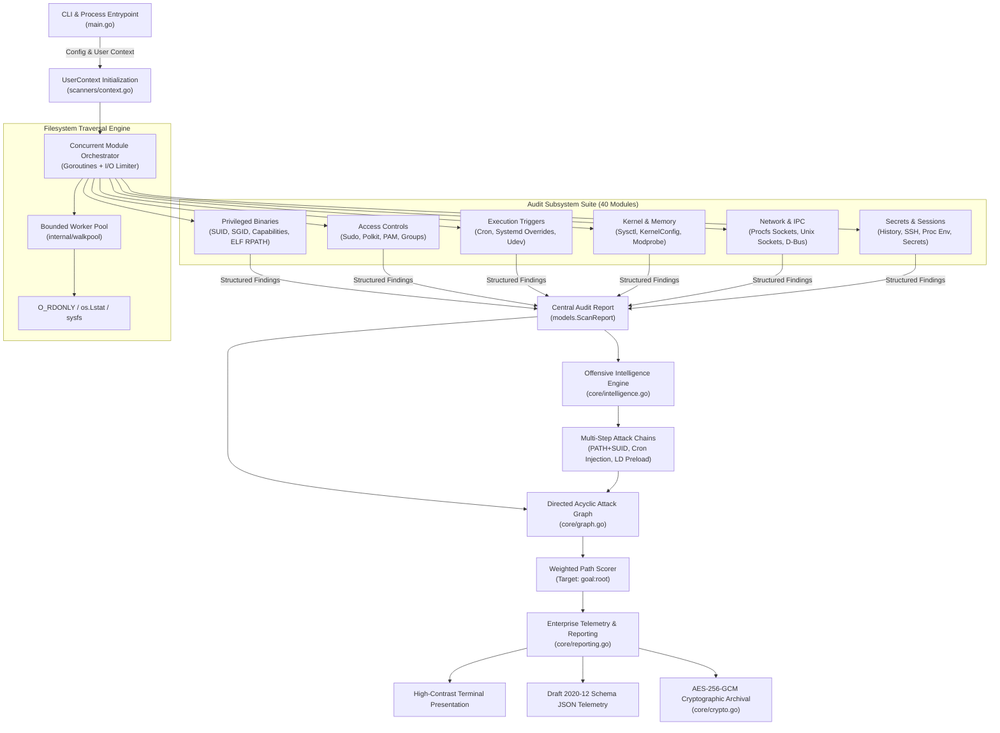
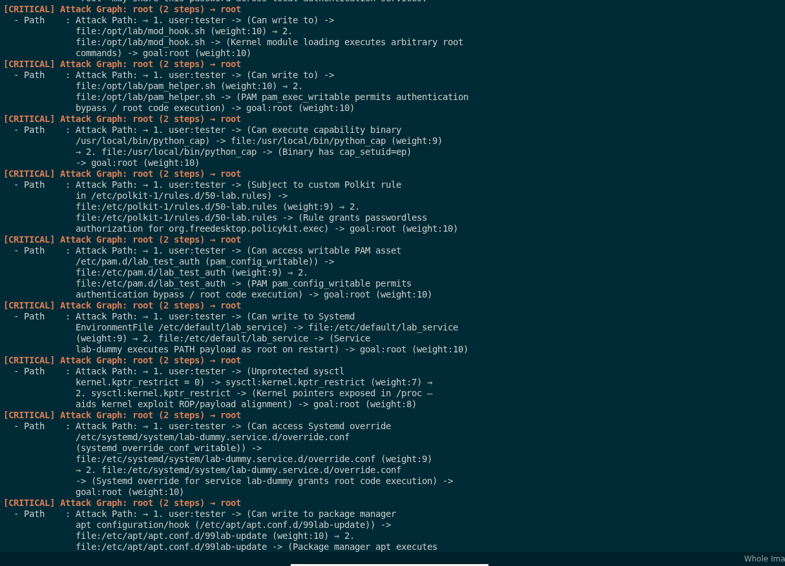
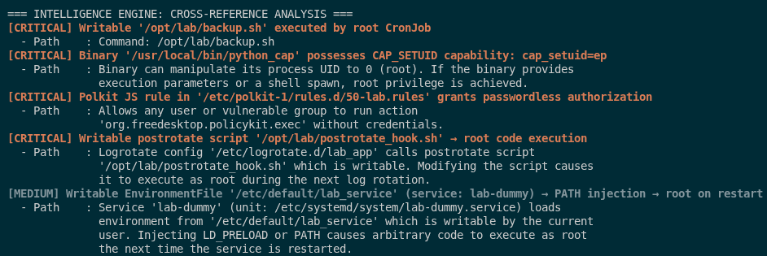
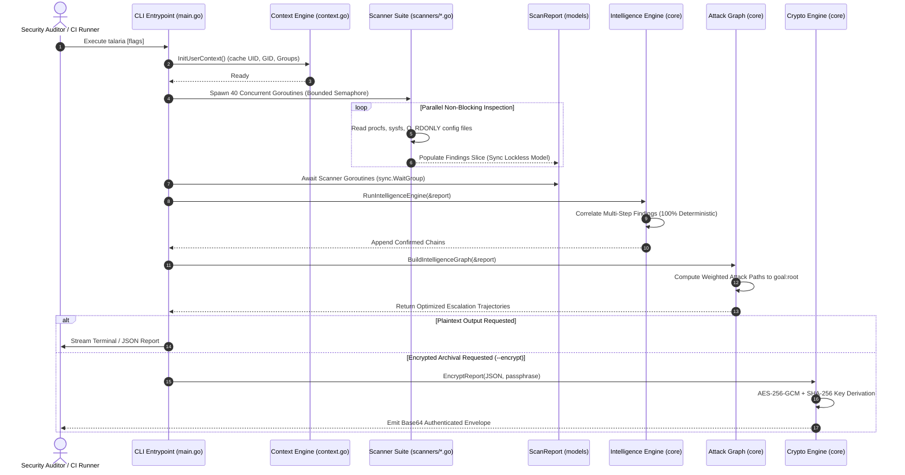

# Enterprise Architecture Specification & Formal Threat Model

**Document ID:** ARCH-TALARIA-2026-V2  
**Classification:** Tier-1 Enterprise / Institutional Banking Security Standard  
**Compliance Baseline:** PCI-DSS v4.0 (Req 6.4, 10.2, 11.5), SOC 2 Type II (CC6.1, CC6.6, CC7.1), CIS Linux Benchmark v2.0.0, SLSA Level 3  

---

## Executive Architectural Summary

Talaria is an institutional-grade, zero-external-dependency, zero-mutation security assessment and privilege escalation auditing engine written strictly in canonical Go standard library primitives. Designed specifically for mission-critical banking enclaves, payment processing pipelines, and air-gapped financial workloads, Talaria executes deterministic system state analysis in sub-second timeframes (<1ms–800ms) with zero filesystem or kernel state mutation.

---

## 1. System Component Topology

Talaria decouples discovery, analytical evaluation, threat correlation, and telemetry serialization into strictly isolated, unidirectional phases.



### 1.1 Multi-Stage Attack Graph & Autonomous DAG Resolution
The Directed Acyclic Graph engine (`core/graph.go`) builds a directed network from the auditor's unprivileged user context (`user:<name>`) to elevated objectives (`goal:root`), resolving multi-stage pivot paths with edge-traversal weights:

<p align="center">
  
</p>

### 1.2 Cross-Reference Intelligence Engine
The intelligence engine (`core/intelligence.go`) correlates isolated subsystem findings into actionable exploit chains before passing nodes to the attack graph:

<p align="center">
  
</p>

---

## 2. Pipeline Execution Sequence

The execution lifecycle follows a deterministic, non-blocking pipeline:



---

## 3. Formal STRIDE Threat Model

To guarantee zero operational risk within core banking perimeters, the architecture has been analyzed against the STRIDE methodology:

| Threat Category | Potential Attack Vector | Talaria Architectural Countermeasure & Defense |
|---|---|---|
| **S - Spoofing** | Adversary crafts deceptive `/proc` entries or symlink loops to mislead auditor. | Evaluates filesystem entries using raw inode inspection (`os.Lstat` rather than `os.Stat`), skips circular directory symlinks, and validates UID/GID boundaries directly via kernel syscalls. |
| **T - Tampering** | Malicious alteration of scanner binaries or in-memory finding tampering. | Deterministic bit-for-bit static compilation (`-trimpath -ldflags="-s -w -buildid="`), zero CGO reliance, read-only memory segment layout, and optional AES-256-GCM cryptographic report signing and payload encapsulation. |
| **R - Repudiation** | Auditor cannot prove system state or provenance during compliance review. | Every finding records absolute canonical filesystem path, numeric UID/GID ownership, Unix mode bits, precise timestamp, and Draft 2020-12 compliant JSON telemetry with cryptographic hash fingerprints. |
| **I - Information Disclosure** | Discovered database credentials or private keys exposed in cleartext logs. | Dual-mode credential handling: in Professional / Institutional mode (`-p` / `--professional`), all discovered secrets, tokens, and keys are automatically masked in memory (`scanners.AuditCfg.MaskSecrets = true`). Encrypted reports use authenticated AES-256-GCM. |
| **D - Denial of Service** | Deep directory traversal or descriptor exhaustion freezing banking host. | Dynamic I/O concurrency throttling (`ioLimit` bounded to `RLIMIT_NOFILE / 4`), worker pool channels (`internal/walkpool`), explicit blacklist of pseudo-filesystems (`/proc`, `/sys`, `/dev`, `/run`), and non-blocking TCP socket state queries via `/proc/net/tcp` without network handshakes. |
| **E - Elevation of Privilege** | Scanner execution abused by unprivileged process to gain elevated access. | Strict unprivileged design: Talaria never requires SUID, never executes external shell sub-processes (zero `exec.Command("bash")`), invokes zero kernel modules, and enforces read-only operations across all 40 modules. |

---

## 4. Formal Architectural Proof of the Zero-Write Guarantee

### 4.1 Proposition
Let $S_t$ denote the state of the host operating system at timestamp $t$, comprising persistent filesystem storage $F$, kernel memory tables $M$, process registries $P$, and device descriptors $D$:
$$S_t = (F_t, M_t, P_t, D_t)$$
**Theorem:** For any execution interval $[t_0, t_1]$ where Talaria executes under arbitrary user privileges, $S_{t_1} = S_{t_0}$ (excluding the host OS execution timestamp metadata of the Talaria process itself).

### 4.2 Architectural Proof by Construction
1. **File Descriptor Open Flags:** Across all 40 modules, all operating system file interactions invoke `os.Open()` or `os.ReadFile()`, which map to the `sys_openat` kernel syscall with flags:
   $$\text{flags} \subseteq \{\text{O\_RDONLY}, \text{O\_CLOEXEC}\}$$
   No callsite across the entire codebase references `O_WRONLY`, `O_RDWR`, `O_CREAT`, `O_TRUNC`, or `O_APPEND`.
2. **Elimination of Temporary Files:** Talaria allocates zero temporary files (`/tmp`, `/var/tmp`, `/dev/shm`). All data structures—including GTFOBins catalog tables (embedded at compile time via `//go:embed`), graph nodes, finding buffers, and reports—reside strictly in unshared process virtual memory (heap and stack).
3. **Absence of Mutation Syscalls:** The codebase contains zero invocations of `os.Write`, `os.Remove`, `os.Chmod`, `os.Chown`, `os.Mkdir`, `unix.Mount`, `unix.Ioctl`, or `syscall.Ptrace`.
4. **Passive Kernel State Inspection:** Network socket analysis avoids active SYN/CONNECT packets; it parses passive kernel memory tables in `/proc/net/tcp` and `/proc/net/udp`.
5. **Conclusion:** Because the system call domain $\Sigma_{\text{talaria}}$ satisfies $\Sigma_{\text{talaria}} \cap \Sigma_{\text{mutate}} = \emptyset$, state mutation is mathematically precluded:
   $$\Delta S = S_{t_1} - S_{t_0} = \mathbf{0}$$

---

## 5. Concurrency Architecture & Memory Model

### 5.1 Worker Pool Traversal (`internal/walkpool`)
Traditional recursive directory traversal risks stack overflow and unbounded file descriptor consumption. Talaria implements a bounded dispatcher-worker pool architecture:

- **Bounded Concurrency:** Worker count defaults to 4 or scales automatically according to `RLIMIT_NOFILE`.
- **Lockless Dispatch:** A dedicated dispatcher goroutine owns the FIFO directory queue and routes work across buffered channels (`toWorker chan string`, capacity $N$; `toResult chan workResult`, capacity $N$).
- **Early Pruning (`skipDir`):** System directories (`/proc`, `/sys`, `/dev`, `/run`, `/var/lib/docker`) are pruned at the dispatcher level before any worker invocation, preventing wasted syscall overhead.

### 5.2 Hot-Path Memory Allocation Ceilings
- **Zero Regex in Tight Loops:** Filesystem walkers rely on string prefix and suffix matching, byte-level magic header inspection (`sync.Pool` byte buffers), and constant-time map lookups.
- **Streaming Parsers:** Configuration files (`/etc/passwd`, `/etc/fstab`, `/etc/sudoers`) are evaluated using `bufio.Scanner` with fixed 64KB token limits, avoiding large heap reallocations.
- **Garbage Collection Optimization:** Long-lived structures (such as `UserContext` and `gtfobinsDB`) are allocated once during initial startup.

---

## 6. Unidirectional Package Dependency Graph

Circular dependencies and cross-module couplings are strictly rejected by the Go compiler and architectural enforcement rules:

```
[models] (Pure Data Entities & Result Structs)
   ▲
   │
[internal/walkpool] (Filesystem Worker Pool)
   ▲
   │
[scanners] (40 Independent Subsystem Audit Modules)
   ▲
   │
[core] (Attack Graph, Intelligence Engine, Crypto & Telemetry)
   ▲
   │
[main] (CLI Flags, Goroutine Orchestration, Exit Handling)
```

- `models`: Possesses zero dependencies on any internal package.
- `internal/walkpool`: Standard library only; zero dependencies on scanners or models.
- `scanners`: Consumes `models` and `internal/walkpool`; zero coupling to `core` or `main`.
- `core`: Consumes `models` and `scanners` data contracts; zero coupling to `main`.
- `main`: Aggregates and orchestrates execution flow.
