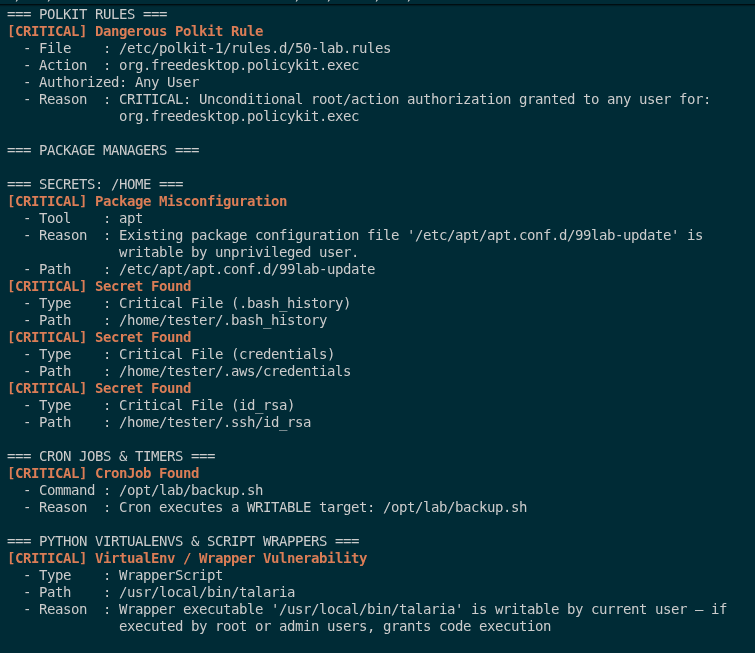

# Talaria — Multi-Vector Testing Laboratory & Verification Guide

This directory provides a **Docker-based laboratory environment** to test all scanner modules, cross-referencing attack chains, and intelligence graph traversals against controlled misconfigurations in a clean Debian environment.

---

## 🚀 Quick Start Instructions

### 1. Build & Launch Interactive Container

```bash
# Build the multi-vector lab image
docker-compose -f docker-compose.lab.yml build

# Drop into interactive shell as unprivileged user 'tester'
docker-compose -f docker-compose.lab.yml run --rm talaria-lab
```

---

## 🧪 Testing Scanner Modules & Vectors

Inside the container shell, run `talaria` to audit the 26+ scanner modules:

```bash
# 1. Full system audit & Attack Graph generation
talaria

# 2. Audit specific modules (e.g. PAM, Capabilities, Systemd Overrides, Sysctl)
talaria --scan pam,capabilities,systemdoverrides,sysctl

# 3. Enterprise audit report (suppresses exploit hints)
talaria --professional
```

### Visual Verification in the Docker Testing Lab

When executing a full audit inside the container, Talaria correlates all injected vulnerabilities, calculates the optimal escalation graph, and completes the scan in sub-second time (<250ms):

<p align="center">
  
</p>

Individual modules actively identify injected misconfigurations (such as dangerous Polkit rules, writable package manager hooks, credentials in home directories, and cron job script targets):

<p align="center">
  
</p>

---

## 🔍 How to Verify Misconfigurations & Test Hardening

Security auditing tools verify privilege escalation vectors by evaluating file DAC permissions, Linux capabilities, procfs sysctl keys, and process contexts.

You can verify and harden each finding inside the container:

### Vector 1: Writable PAM Configuration (`/etc/pam.d/lab_test_auth`)
- **Verification**: Check write permissions:
  ```bash
  ls -l /etc/pam.d/lab_test_auth
  # Returns: -rw-rw-rw- (world-writable)
  ```
- **Remediation**:
  ```bash
  sudo chmod 644 /etc/pam.d/lab_test_auth
  ```
- **Re-test**: Re-run `talaria --scan pam` — finding is resolved.

---

### Vector 2: Writable CronJob Executable (`/opt/lab/backup.sh`)
- **Verification**: Inspect cron job owner and target script permissions:
  ```bash
  cat /etc/cron.d/lab_cron
  ls -l /opt/lab/backup.sh
  # Returns: executed by root, script is world-writable (-rwxrwxrwx)
  ```
- **Remediation**:
  ```bash
  sudo chmod 755 /opt/lab/backup.sh
  sudo chown root:root /opt/lab/backup.sh
  ```
- **Re-test**: Re-run `talaria` — Writable Scheduled Execution Chain is cleared.

---

### Vector 3: Dangerous Linux File Capability (`cap_setuid+ep`)
- **Verification**: Inspect capability bits on binary:
  ```bash
  getcap /usr/local/bin/python_cap
  # Returns: /usr/local/bin/python_cap cap_setuid=ep
  ```
- **Remediation**:
  ```bash
  sudo setcap -r /usr/local/bin/python_cap
  ```
- **Re-test**: Re-run `talaria --scan capabilities` — capability alert cleared.

---

### Vector 4: Writable Systemd Override Drop-in
- **Verification**:
  ```bash
  ls -l /etc/systemd/system/lab-dummy.service.d/override.conf
  ```
- **Remediation**:
  ```bash
  sudo chmod 644 /etc/systemd/system/lab-dummy.service.d/override.conf
  ```
- **Re-test**: Re-run `talaria --scan systemdoverrides` — override vulnerability cleared.
