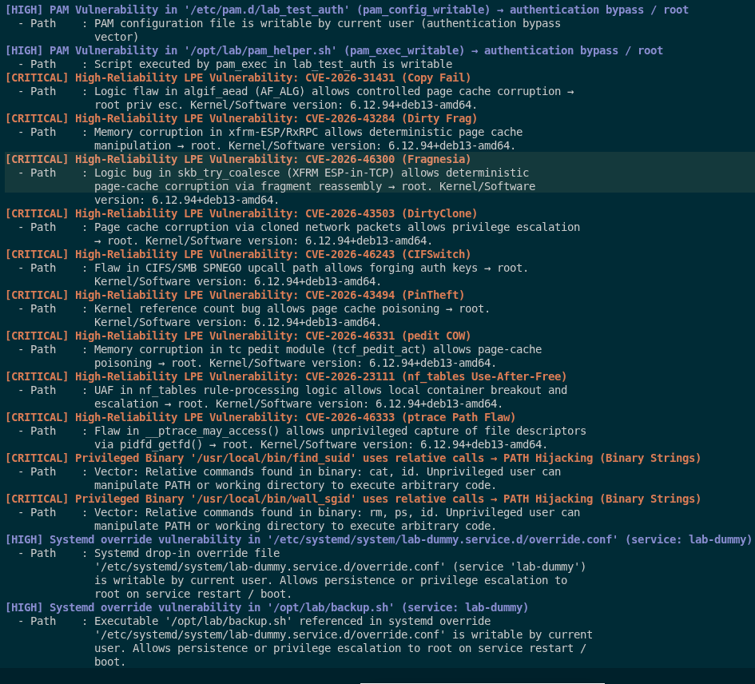
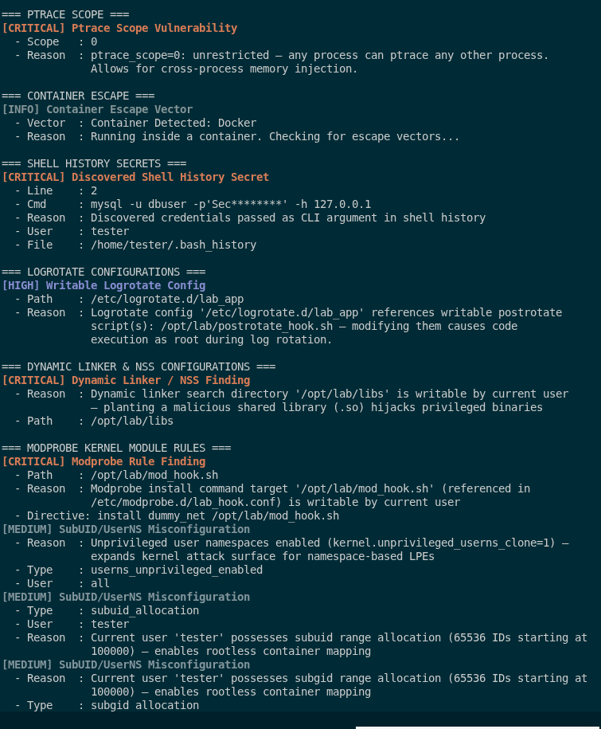

# Talaria — Comprehensive Scanner Documentation

This document provides an exhaustive, line-of-sight technical breakdown of all **51 specialized scanner modules** built into Talaria. It details the scanning targets, detection logic, privilege escalation mechanics, and heuristics used by each module.

---

## Table of Contents

1. [Architecture Overview](#architecture-overview)
2. [Detailed Module Documentation](#detailed-module-documentation)
   - [1. Sensitive Data Harvesting (`scanners/secrets.go`)](#1-sensitive-data-harvesting-scannerssecretsgo)
   - [2. SUID Binary Auditor (`scanners/suid.go`)](#2-suid-binary-auditor-scannerssuidgo)
   - [3. SGID Binary Auditor (`scanners/suid.go`)](#3-sgid-binary-auditor-scannerssuidgo)
   - [4. Linux Capabilities Scanner (`scanners/capabilities.go`)](#4-linux-capabilities-scanner-scannerscapabilitiesgo)
   - [5. Sudo Privileges & Configuration Auditor (`scanners/sudo.go`)](#5-sudo-privileges--configuration-auditor-scannerssudogo)
   - [6. Cron Jobs & Systemd Timers Scanner (`scanners/cronjobs.go`)](#6-cron-jobs--systemd-timers-scanner-scannerscronjobsgo)
   - [7. Process & Credential Monitoring (`scanners/processes.go`)](#7-process--credential-monitoring-scannersprocessesgo)
   - [8. Writable Files & Directories Auditor (`scanners/writeable.go`)](#8-writable-files--directories-auditor-scannerswriteablego)
   - [9. Logrotate Configuration Auditor (`scanners/logrotate.go`)](#9-logrotate-configuration-auditor-scannerslogrotatego)
   - [10. Systemd EnvironmentFile Auditor (`scanners/env_file.go`)](#10-systemd-environmentfile-auditor-scannersenv_filego)
   - [11. Unix Domain Socket Auditor (`scanners/sockets.go`)](#11-unix-domain-socket-auditor-scannerssocketsgo)
   - [12. System File Permissions Auditor (`scanners/filepermissions.go`)](#12-system-file-permissions-auditor-scannersfilepermissionsgo)
   - [13. Binary Relative PATH Exploit Scanner (`scanners/fileperms_exploit.go`)](#13-binary-relative-path-exploit-scanner-scannersfileperms_exploitgo)
   - [14. Privileged Group Membership Auditor (`scanners/groups.go`)](#14-privileged-group-membership-auditor-scannersgroupsgo)
   - [15. Environment PATH Hijacking Auditor (`scanners/path_hijack.go`)](#15-environment-path-hijacking-auditor-scannerspath_hijackgo)
   - [16. SSH Authorized Keys & Exposed Private Keys (`scanners/ssh_keys.go`)](#16-ssh-authorized-keys--exposed-private-keys-scannersssh_keysgo)
   - [17. Process Ptrace Scope Auditor (`scanners/processes.go`)](#17-process-ptrace-scope-auditor-scannersprocessesgo)
   - [18. Container Environment & Escape Auditor (`scanners/container.go`)](#18-container-environment--escape-auditor-scannerscontainergo)
   - [19. D-Bus System Policy Auditor (`scanners/polkit.go`)](#19-d-bus-system-policy-auditor-scannerspolkitgo)
   - [20. Local Network Service Auditor (`scanners/services.go`)](#20-local-network-service-auditor-scannersservicesgo)
   - [21. Package Manager & Privilege Tool Auditor (`scanners/packages.go`)](#21-package-manager--privilege-tool-auditor-scannerspackagesgo)
   - [22. Active Session & X11 Hijacking (`scanners/sessions.go`, `scanners/xauthority.go`)](#22-active-session--x11-hijacking-scannerssessionsgo-scannersxauthoritygo)
   - [23. Kernel Configuration Audit (`scanners/kernelconfig.go`)](#23-kernel-configuration-audit-scannerskernelconfiggo)
   - [24. PolicyKit Rules Auditor (`scanners/polkit.go`)](#24-policykit-rules-auditor-scannerspolkitgo)
   - [25. Internal Network Connection Auditor (`scanners/network.go`)](#25-internal-network-connection-auditor-scannersnetworkgo)
   - [26. Kernel & System CVE Vulnerability Engine (`scanners/vulnerabilities.go`)](#26-kernel--system-cve-vulnerability-engine-scannersvulnerabilitiesgo)
   - [27. Shell History & Token Extraction (`scanners/history.go`)](#27-shell-history--token-extraction-scannershistorygo)
   - [28. PAM Configuration Auditor (`scanners/pam.go`)](#28-pam-configuration-auditor-scannerspamgo)
   - [29. Sysctl Hardening Parameters (`scanners/sysctl.go`)](#29-sysctl-hardening-parameters-scannerssysctlgo)
   - [30. Systemd Overrides & Drop-in Units (`scanners/systemd_overrides.go`)](#30-systemd-overrides--drop-in-units-scannerssystemd_overridesgo)
   - [31. SubUID & SubGID Namespaces (`scanners/subuid.go`)](#31-subuid--subgid-namespaces-scannerssubuidgo)
   - [32. Filesystem Mount Flags & NFS (`scanners/mounts.go`, `scanners/nfs.go`)](#32-filesystem-mount-flags--nfs-scannersmountsgo-scannersnfsgo)
   - [33. Udev Device Rules (`scanners/udev.go`)](#33-udev-device-rules-scannersudevgo)
   - [34. Cron Drop-in Directories (`scanners/cron_dirs.go`)](#34-cron-drop-in-directories-scannerscron_dirsgo)
   - [35. LD_PRELOAD & NSSwitch Library Order (`scanners/ld_nss.go`)](#35-ld_preload--nsswitch-library-order-scannersld_nssgo)
   - [36. Modprobe & Kernel Module Loading (`scanners/modprobe.go`)](#36-modprobe--kernel-module-loading-scannersmodprobego)
   - [37. Cloud Metadata IMDS (`scanners/cloud_meta.go`)](#37-cloud-metadata-imds-scannerscloud_metago)
   - [38. Python VirtualEnv Wrappers (`scanners/venv_wrap.go`)](#38-python-virtualenv-wrappers-scannersvenv_wrapgo)
   - [39. Python sys.path Library Hijacking (`scanners/python_hijack.go`)](#39-python-syspath-library-hijacking-scannerspython_hijackgo)
   - [40. ELF Binary RPATH / RUNPATH Injection (`scanners/elf_rpath.go`)](#40-elf-binary-rpath--runpath-injection-scannerself_rpathgo)
   - [41. Auditd Configuration & Tampering (`scanners/auditd.go`)](#41-auditd-configuration--tampering-scannersauditdgo)
   - [42. Process Memory Environment Auditor (`scanners/proc_env.go`)](#42-process-memory-environment-auditor-scannersproc_envgo)
   - [43. Sudoers.d Drop-in Writability (`scanners/sudoers_dropin.go`)](#43-sudoersd-drop-in-writability-scannerssudoers_dropingo)
   - [44. Root Shell RC File Poisoning (`scanners/shell_rc.go`)](#44-root-shell-rc-file-poisoning-scannersshell_rcgo)
   - [45. At Daemon Scheduled Jobs (`scanners/at_jobs.go`)](#45-at-daemon-scheduled-jobs-scannersat_jobsgo)
   - [46. /etc/fstab User & Bind Mount Abuse (`scanners/fstab.go`)](#46-etcfstab-user--bind-mount-abuse-scannersfstabgo)
   - [47. Snap & Flatpak SUID Helper Audit (`scanners/snap_audit.go`)](#47-snap--flatpak-suid-helper-audit-scannerssnap_auditgo)
   - [48. Git Shared Hook Script Injection (`scanners/git_hooks.go`)](#48-git-shared-hook-script-injection-scannersgit_hooksgo)
   - [49. Xinetd Service Hijacking (`scanners/xinetd.go`)](#49-xinetd-service-hijacking-scannersxinetdgo)
   - [50. Wildcard Injection in Backup Scripts (`scanners/wildcards.go`)](#50-wildcard-injection-in-backup-scripts-scannerswildcardsgo)
   - [51. GTFOBins Privilege Escalation Matcher (`scanners/gtfobins.go`)](#51-gtfobins-privilege-escalation-matcher-scannersgtfobinsgo)

---

## Architecture Overview

Talaria operates using a concurrent multi-module model. Core system checks are split across independent scanners executed in parallel inside goroutines. 
- **Parallel Traversal**: Filesystem iteration is handled by `internal/walkpool`, a high-throughput bounded worker pool that balances disk I/O while enforcing directory exclusion filters (`GlobalIgnoreDirs`).
- **Context Caching**: System user and group contexts are computed once via `scanners.InitUserContext()` and shared across modules to eliminate redundant `getpwuid` / `getgrgid` syscalls.
- **Correlation Engine**: Individual findings feed into `core.RunIntelligenceEngine()`, which cross-references vulnerabilities to discover multi-stage privilege escalation paths (e.g. Writable Systemd EnvironmentFile + Root Service Restart -> Root Execution).

---

## Detailed Module Documentation

### 1. Sensitive Data Harvesting (`scanners/secrets.go`)
* **Target Directories**: `/home`, `/var/www`, `/opt`, `/srv`, `/etc`, `/var/backups`, `/tmp`, `/dev/shm`, `/root`.
* **Inspection Logic**:
  - **Filename Matching**: Identifies critical key files (`id_rsa`, `id_ed25519`, `.p12`, `.kdbx`, `.bash_history`, `.aws/credentials`, `.kube/config`, `shadow` copies, `sudoers`).
  - **Content Regex Matching**: Inspects config files (`.env`, `config.php`, `settings.py`, `database.yml`, `docker-compose.yml`, `.ovpn`, `my.cnf`, `wp-config.php`) using pre-compiled regex for API tokens, database connection passwords, cloud credentials, and private keys.
* **FP Reduction**: Ignores binary files using MIME/magic byte header detection (`headerPool` byte buffers) and caps maximum scanned file size.

### 2. SUID Binary Auditor (`scanners/suid.go`)
* **Inspection Logic**: Walks the filesystem filtering entries with `ModeSetuid` mode bits (`04000`).
* **Noise Reduction & AppArmor Awareness**:
  - Automatically filters standard, well-audited system SUID binaries (`passwd`, `su`, `sudo`, `chsh`, `pkexec`, `mount`, etc.) unless GTFOBins flags special vectors or ownership anomalies exist.
  - Dynamically checks `/sys/kernel/security/apparmor/profiles` to suppress false positive findings for sandboxed applications under Snap (`/snap/`) and Flatpak (`/var/lib/flatpak/`).
* **Exploit Engine Integration**: Matches binaries against `gtfobins.json` (380+ embedded GTFOBins entries) to output actionable exploit hints.

### 3. SGID Binary Auditor (`scanners/suid.go`)
* **Inspection Logic**: Scans for files with `ModeSetgid` mode bits (`02000`).
* **Privilege Group Auditing**: Flags SGID binaries owned by dangerous system groups (`shadow`, `disk`, `kmem`, `tty`, `audio`, `video`, `staff`).
* **Escalation Vector**: Group ownership of `shadow` permits reading `/etc/shadow`; ownership of `disk` permits raw block device reads (`/dev/sda`).

### 4. Linux Capabilities Scanner (`scanners/capabilities.go`)
* **Inspection Logic**: Invokes system `getcap -r` to audit file capability extended attributes (`security.capability`).
* **Target Capabilities**: Filters for high-risk capabilities: `cap_setuid`, `cap_setgid`, `cap_sys_admin`, `cap_sys_ptrace`, `cap_dac_override`, `cap_dac_read_search`, `cap_fowner`, `cap_fsetid`, `cap_sys_module`.
* **Exploit Context**: Generates capability-specific exploit command hints (e.g. `cap_dac_read_search` file reading or `cap_setuid` process execution).

### 5. Sudo Privileges & Configuration Auditor (`scanners/sudo.go`)
* **Inspection Logic**: Executes `sudo -l -n` (or uses provided password via `sudo -S -l`).
* **Rule Parsing**:
  - Parses output for `NOPASSWD: ALL`, `NOPASSWD: /path/to/bin`, `SETENV`, and `LD_PRELOAD` in `env_keep`.
  - Flags custom `sudoers` rules permitting execution of dangerous binaries listed in GTFOBins.

### 6. Cron Jobs & Systemd Timers Scanner (`scanners/cronjobs.go`)
* **Inspection Targets**: `/etc/crontab`, `/etc/cron.d/*`, `/etc/cron.daily/*`, `/etc/cron.hourly/*`, `/var/spool/cron/crontabs/*`, `/etc/systemd/system/*.timer`, `/lib/systemd/system/*.timer`.
* **Detection Logic**:
  - Identifies scheduled tasks executing as `root`.
  - Audits invoked scripts/binaries for write permissions by the current unprivileged user.
  - Flags wildcard injection vulnerabilities in cron commands (`tar *`, `chown *`, `rsync *`).

### 7. Process & Credential Monitoring (`scanners/processes.go`)
* **Inspection Targets**: `/proc/[0-9]+/cmdline` and `/proc/[0-9]+/environ`.
* **Detection Logic**:
  - Scans active process command-line arguments for exposed credentials (`--password=`, `-p`, `api_key=`, `token=`).
  - Identifies processes running with elevated privileges that possess writable environment file configurations.

### 8. Writable Files & Directories Auditor (`scanners/writeable.go`)
* **Inspection Logic**: Uses pre-computed `UserContext` to evaluate whether the current user can write (`UserContext.CanWrite`) to root-owned files across system paths.
* **Specialized Sub-Scanners**:
  - **Systemd Generators**: `/lib/systemd/system-generators/`, `/usr/lib/systemd/system-generators/`.
  - **Writable Systemd Services**: Checks `ExecStart`, `ExecStartPre`, `ExecReload` binary paths for write permissions.
  - **Udev Rules**: `/etc/udev/rules.d/`, `/lib/udev/rules.d/`.
  - **MOTD & Profile.d**: `/etc/update-motd.d/`, `/etc/profile.d/`.
  - **SysV Init Scripts**: `/etc/init.d/`, `/etc/rc*.d/`.
  - **Anacrontab**: `/etc/anacrontab`.
  - **At Job Queue**: `/var/spool/at/`, `/var/spool/cron/atjobs/`.

### 9. Logrotate Configuration Auditor (`scanners/logrotate.go`)
* **Inspection Targets**: `/etc/logrotate.conf` and `/etc/logrotate.d/*`.
* **Detection Logic**: Identifies logrotate directives running as root where either the target log file, configuration file, or script execution directives (`prerotate`, `postrotate`) are writable by unprivileged users.

### 10. Systemd EnvironmentFile Auditor (`scanners/env_file.go`)
* **Inspection Targets**: `/etc/systemd/system/*.service`, `/lib/systemd/system/*.service`.
* **Detection Logic**: Parses service units for `EnvironmentFile=` entries. If the environment file is writable by the current user, flags it as vulnerable to environment variable injection (`LD_PRELOAD`, `PATH`).

### 11. Unix Domain Socket Auditor (`scanners/sockets.go`)
* **Inspection Targets**: `/var/run`, `/run`, `/tmp`, `/dev/shm`.
* **Detection Logic**: Filters UNIX domain sockets (`S_IFSOCK`). Identifies writable control sockets for privileged daemons (e.g. `/var/run/docker.sock`, LXC sockets, Podman sockets).

### 12. System File Permissions Auditor (`scanners/filepermissions.go`)
* **Inspection Targets**: `/etc/passwd`, `/etc/shadow`, `/etc/sudoers`, `/etc/sudoers.d/*`, `/etc/group`, `/etc/gshadow`, `/etc/fstab`.
* **Detection Logic**: Checks mode bits and ownership for dangerous access states (e.g., world-writable `/etc/passwd`, readable `/etc/shadow`).

### 13. Binary Relative PATH Exploit Scanner (`scanners/fileperms_exploit.go`)
* **Inspection Logic**: Inspects SUID/SGID executable binaries for relative system call invocations (e.g., calling `system("service apache2 restart")` instead of `/bin/service`).
* **Exploit Vector**: Enables PATH hijacking where an unprivileged user prepends a malicious binary to `$PATH`.

### 14. Privileged Group Membership Auditor (`scanners/groups.go`)
* **Inspection Targets**: User supplementary group IDs (`u.GroupIds()`).
* **Detection Logic**: Flags dangerous group memberships (`docker`, `lxd`, `disk`, `shadow`, `sudo`, `wheel`, `kmem`, `input`, `libvirt`). Provides targeted escalation guidance for each group.

### 15. Environment PATH Hijacking Auditor (`scanners/path_hijack.go`)
* **Inspection Logic**: Parses the active `$PATH` environment variable.
* **Detection Logic**: Identifies writable directories in `$PATH`, relative path entries (`.`), or empty path elements that allow binary spoofing.

### 16. SSH Authorized Keys & Exposed Private Keys (`scanners/ssh_keys.go`)
* **Inspection Targets**: `~/.ssh/` directories across `/home/*` and `/root`.
* **Detection Logic**:
  - Finds unencrypted SSH private keys (`id_rsa`, `id_ed25519`, `id_ecdsa`).
  - Identifies writable `authorized_keys` files allowing arbitrary public key insertion.

### 17. Process Ptrace Scope Auditor (`scanners/processes.go`)
* **Inspection Target**: `/proc/sys/kernel/yama/ptrace_scope`.
* **Detection Logic**: A value of `0` indicates unrestricted ptrace scope, permitting unprivileged processes to attach (`gdb` / `ptrace`) to other running processes owned by the same user.

### 18. Container Environment & Escape Auditor (`scanners/container.go`)
* **Inspection Targets**: `/.dockerenv`, `/proc/1/cgroup`, `/proc/cmdline`.
* **Detection Logic**: Detects container execution environments and evaluates escape vectors: `--privileged` mode, exposed Docker socket, mounted host filesystems, or dangerous capabilities (`CAP_SYS_ADMIN`).

### 19. D-Bus System Policy Auditor (`scanners/polkit.go`)
* **Inspection Targets**: `/etc/dbus-1/system.d/*.conf`.
* **Detection Logic**: Parses D-Bus XML policy files to identify method calls or signals allowed to `context="default"` or unprivileged users on privileged system buses.

### 20. Local Network Service Auditor (`scanners/services.go`)
* **Inspection Targets**: Loopback services on `127.0.0.1` / `::1`.
* **Detection Logic**: Connects to internal daemons (MySQL, Redis, MongoDB, PostgreSQL, Memcached) to test for blank passwords or missing authentication.

### 21. Package Manager & Privilege Tool Auditor (`scanners/packages.go`)
* **Inspection Logic**: Audits alternative elevation utilities (`doas`, `pkexec`), Snap/Flatpak package permissions, and custom repository configurations.

### 22. Active Session & X11 Hijacking (`scanners/sessions.go`, `scanners/xauthority.go`)
* **Inspection Targets**: `/tmp/tmux-*`, `/tmp/screens/*`, `~/.Xauthority`.
* **Detection Logic**:
  - Identifies readable/writable `tmux` or `screen` sockets belonging to other users.
  - Detects readable `.Xauthority` files enabling X11 session hijacking and keylogging.

### 23. Kernel Configuration Audit (`scanners/kernelconfig.go`)
* **Inspection Targets**: `/proc/config.gz`, `/boot/config-*`.
* **Detection Logic**: Checks for dangerous kernel compilation options (`CONFIG_DEVKMEM=y`, `CONFIG_STRICT_DEVMEM=n`, `CONFIG_LEGACY_VSYSCALL_EMULATE=y`).

### 24. PolicyKit Rules Auditor (`scanners/polkit.go`)
* **Inspection Targets**: `/etc/polkit-1/rules.d/*.rules`, `/etc/polkit-1/localauthority/*.pkla`.
* **Detection Logic**: Analyzes PolicyKit JavaScript rules and local authority files for rules granting `polkit.Result.YES` without authentication.

### 25. Internal Network Connection Auditor (`scanners/network.go`)
* **Inspection Targets**: `/proc/net/tcp`, `/proc/net/tcp6`, `/proc/net/udp`.
* **Detection Logic**: Identifies active internal listening ports while ignoring short-lived ephemeral outbound connections (`>= 32768`) to suppress noise.

### 26. Kernel & System CVE Vulnerability Engine (`scanners/vulnerabilities.go`)
* **Inspection Targets**: `uname -r`, `/etc/os-release`.
* **Detection Logic**: Compares system kernel version against an integrated 2026 CVE database (DirtyFrag, Fragnesia, Copy Fail, AF_UNIX Diagnostic Race, Dirty Pipe, PwnKit). Uses distribution patch awareness to cross-reference backported security patches and eliminate false positives.

  

### 27. Shell History & Token Extraction (`scanners/history.go`)
* **Inspection Targets**: `~/.bash_history`, `~/.zsh_history`, `~/.sh_history`.
* **Detection Logic**: Parses history files for exposed cleartext tokens, API keys, passwords passed in command lines (`mysql -p`, `curl -u`, `export AWS_SECRET_ACCESS_KEY`), and database credentials.

  

### 28. PAM Configuration Auditor (`scanners/pam.go`)
* **Inspection Targets**: `/etc/pam.d/*`.
* **Detection Logic**: Audits Pluggable Authentication Module configurations for insecure modules (`pam_permit.so`, `pam_exec.so`), writable custom modules, or permissive authentication directives bypassing password checks.

### 29. Sysctl Hardening Parameters (`scanners/sysctl.go`)
* **Inspection Targets**: `/proc/sys/*`, `/etc/sysctl.conf`, `/etc/sysctl.d/*`.
* **Detection Logic**: Evaluates kernel security runtime knobs: `fs.protected_regular`, `fs.protected_fifos`, `fs.protected_hardlinks`, `fs.protected_symlinks`, `kernel.unprivileged_bpf_disabled`, `kernel.kptr_restrict`, and `kernel.dmesg_restrict`.

### 30. Systemd Overrides & Drop-in Units (`scanners/systemd_overrides.go`)
* **Inspection Targets**: `/etc/systemd/system/*.d/*.conf`, `/lib/systemd/system/`.
* **Detection Logic**: Audits unit override directories for drop-in configuration files that are writable by unprivileged users, or that execute attacker-controlled binaries upon service restart.

### 31. SubUID & SubGID Namespaces (`scanners/subuid.go`)
* **Inspection Targets**: `/etc/subuid`, `/etc/subgid`.
* **Detection Logic**: Audits user namespace allocations for rootless container tools (`podman`, `newuidmap`) to identify overlapping or overly permissive root user namespace mappings.

### 32. Filesystem Mount Flags & NFS (`scanners/mounts.go`, `scanners/nfs.go`)
* **Inspection Targets**: `/proc/mounts`, `/etc/fstab`, `/etc/exports`.
* **Detection Logic**: Identifies partitions mounted without `nosuid` or `nodev`, and audits NFS exports configured with `no_root_squash`, which allows remote root execution.

### 33. Udev Device Rules (`scanners/udev.go`)
* **Inspection Targets**: `/etc/udev/rules.d/*`, `/lib/udev/rules.d/*`.
* **Detection Logic**: Inspects device event rules executing scripts on hardware plug/unplug (`RUN+="..."`) for writable script targets or relative command invocations.

### 34. Cron Drop-in Directories (`scanners/cron_dirs.go`)
* **Inspection Targets**: `/etc/cron.d/`, `/etc/cron.daily/`, `/etc/cron.hourly/`, `/etc/cron.weekly/`, `/etc/cron.monthly/`.
* **Detection Logic**: Identifies files within automated cron directories that are directly writable, group-writable by unprivileged groups, or reference non-absolute binaries.

### 35. LD_PRELOAD & NSSwitch Library Order (`scanners/ld_nss.go`)
* **Inspection Targets**: `/etc/ld.so.preload`, `/etc/nsswitch.conf`, `/etc/ld.so.conf.d/*`.
* **Detection Logic**: Detects world-writable dynamic library preloading configurations or writable custom directories listed in dynamic linker search paths.

### 36. Modprobe & Kernel Module Loading (`scanners/modprobe.go`)
* **Inspection Targets**: `/etc/modprobe.d/*`.
* **Detection Logic**: Audits module loader configurations for `install` directives executing custom scripts on demand, and identifies writable configuration files.

### 37. Cloud Metadata IMDS (`scanners/cloud_meta.go`)
* **Inspection Targets**: `169.254.169.254` (AWS, GCP, Azure, DigitalOcean).
* **Detection Logic**: Tests reachability of unauthenticated Instance Metadata Service endpoints (IMDSv1) to detect exposed IAM roles, instance credentials, and startup user-data scripts.

### 38. Python VirtualEnv Wrappers (`scanners/venv_wrap.go`)
* **Inspection Targets**: Python virtual environment activate scripts (`activate`, `activate.csh`, `activate.fish`).
* **Detection Logic**: Audits virtualenv directories in shared or production directories for writable activation wrappers executed by administrators or cron jobs.

### 39. Python sys.path Library Hijacking (`scanners/python_hijack.go`)
* **Inspection Targets**: Python root scripts and standard library search directories (`site-packages`, `dist-packages`).
* **Detection Logic**: Detects import precedence hijacking where an unprivileged user can drop a malicious `.py` file into a directory searched before standard system libraries.

### 40. ELF Binary RPATH / RUNPATH Injection (`scanners/elf_rpath.go`)
* **Inspection Targets**: SUID and privileged ELF binaries.
* **Detection Logic**: Parses ELF binary headers (`DT_RPATH`, `DT_RUNPATH`) to identify insecure library search paths containing relative directories (`.`) or writable paths.

### 41. Auditd Configuration & Tampering (`scanners/auditd.go`)
* **Inspection Targets**: `/etc/audit/auditd.conf`, `/etc/audit/rules.d/*`.
* **Detection Logic**: Checks whether the Linux audit daemon is active, whether immutable mode is set (`-e 2`), and whether audit log files are writable or unprotected.

### 42. Process Memory Environment Auditor (`scanners/proc_env.go`)
* **Inspection Targets**: `/proc/[pid]/environ` across running processes.
* **Detection Logic**: Uses unified `/proc` snapshotting to scan environment blocks of running daemons for exposed passwords, database connection strings, JWT tokens, and SSH keys.

### 43. Sudoers.d Drop-in Writability (`scanners/sudoers_dropin.go`)
* **Inspection Targets**: `/etc/sudoers.d/`, `/etc/sudoers.d/*`.
* **Detection Logic**: Audits `/etc/sudoers.d/` directory permissions. An unprivileged user with write access to this directory can drop an arbitrary file (e.g. `user ALL=(ALL) NOPASSWD: ALL`) for instant root escalation.

### 44. Root Shell RC File Poisoning (`scanners/shell_rc.go`)
* **Inspection Targets**: `/root/.bashrc`, `/root/.profile`, `/root/.zshrc`, `/root/.bash_profile`, `/etc/profile.d/*`.
* **Detection Logic**: Verifies ownership and writability of root user shell startup scripts. If an unprivileged user can write to these files, arbitrary code executes when root logs in.

### 45. At Daemon Scheduled Jobs (`scanners/at_jobs.go`)
* **Inspection Targets**: `/var/spool/cron/atjobs/`, `/var/spool/at/`, `/etc/at.allow`, `/etc/at.deny`.
* **Detection Logic**: Inspects pending `at` jobs scheduled to execute as root. Checks whether target scripts or spool files can be modified by unprivileged users.

### 46. /etc/fstab User & Bind Mount Abuse (`scanners/fstab.go`)
* **Inspection Targets**: `/etc/fstab`.
* **Detection Logic**: Analyzes filesystem mount table for entries specifying `user`, `users`, or writable mount sources, enabling unprivileged mounting with custom SUID binaries.

### 47. Snap & Flatpak SUID Helper Audit (`scanners/snap_audit.go`)
* **Inspection Targets**: `/usr/lib/snapd/snap-confine`, `/snap/*`, `/var/lib/flatpak/*`.
* **Detection Logic**: Audits snap sandbox helpers and confinement binaries for historical local privilege escalation CVEs (e.g. Dirty Sock, CVE-2021-44731 snap-confine race).

### 48. Git Shared Hook Script Injection (`scanners/git_hooks.go`)
* **Inspection Targets**: `.git/hooks/*` across system repositories.
* **Detection Logic**: Detects Git repositories accessed by root or service accounts where hooks (`pre-commit`, `post-checkout`, `post-merge`) are writable by unprivileged users.

### 49. Xinetd Service Hijacking (`scanners/xinetd.go`)
* **Inspection Targets**: `/etc/xinetd.d/*`, `/etc/xinetd.conf`.
* **Detection Logic**: Parses active xinetd service declarations for writable configuration files or service definitions executing writable server binaries as root.

### 50. Wildcard Injection in Backup Scripts (`scanners/wildcards.go`)
* **Inspection Targets**: Scheduled scripts and cron commands executing `tar *`, `rsync *`, `chown *`, `chmod *`, or `zip *`.
* **Detection Logic**: Identifies wildcard parameter expansion in working directories writable by unprivileged users, enabling flag injection (e.g. `--checkpoint-action=exec=sh`).

### 51. GTFOBins Privilege Escalation Matcher (`scanners/gtfobins.go`)
* **Inspection Targets**: Discovered SUID, SGID, sudoers, and capability binaries against embedded GTFOBins catalog.
* **Detection Logic**: Matches binaries against known Unix binaries capable of shell breakout, file read/write, or privilege escalation (e.g. `nmap`, `vim`, `find`, `python`, `perl`, `env`, `awk`).

---
*Documentation compiled for Talaria v2.0.*

